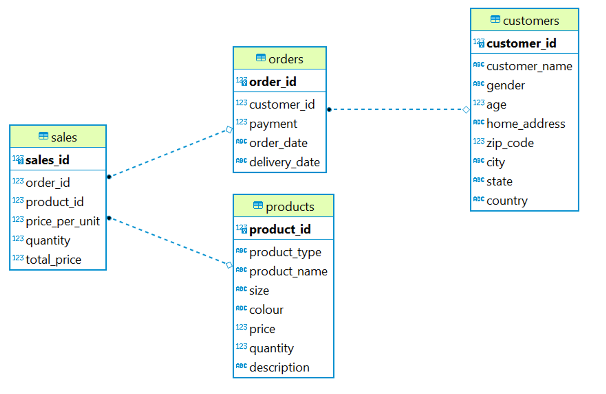

# Online Shop Database Analysis
## Project Overview
This project aims to analyze the database of an online shop application, providing insights into transaction and customer data. The full analysis can be found in my [Medium article](https://medium.com/@farahananda/from-click-to-cart-the-data-magic-behind-online-shopping-a2187b498abc).

## The Database
The database can be found in the [`dump-mini_shop.sql`](datasets/dump-mini_shop.sql) file. It includes the following tables:

| Tables     | Descriptions                                                                                      |
|------------|---------------------------------------------------------------------------------------------------|
| products   | Stores details about products, including their ID, type, name, size, color, price, quantity, and description. The primary key is "product_id." |
| customers  | Contains customer information, including customer_id, name, gender, age, address along with zip code, city, state, and country. The primary key is "customer_id." |
| orders     | Includes order details, such as order_id, customer_id, order date, and delivery date. The primary key is "order_id." |
| sales      | Stores sales data, including sales_id, order_id, product_id, price per unit, quantity, and total price. The primary key is "sales_id." |

The relationships between these tables can be seen in the ERD.

Additionally, the [`item.sql`](datasets/item.sql) file includes the `item` table, which stores information about items in the warehouse, such as item ID, item name, item size in square feet, and whether the item is a prime product or not. Here's an example of the data:

| item_id | item_name | item_size_sqft | is_prime |
| --- | --- | --- | --- |
| 96 | item1 | 800 | TRUE |
| 97 | item2 | 750 | TRUE |

We also created new tables, `shops` and `carts`, to support additional features:

| Table  | Description                                                                                     |
|--------|-------------------------------------------------------------------------------------------------|
| shops  | Stores information about each shop, including their ID, name, address, and email. The primary key is "shop_id." |
| carts  | Stores information about shopping carts, including their ID, customer ID, date, product ID, and quantity. The primary key is "cart_id," and it references the `customers` and `products` tables through foreign keys. |

With these additions, the new table relationships is in the updated ERD.

## Objectives
### Find information about how many product have been ordered
- [Products that have been ordered more than once](queries/w4_1.sql).
- [Count of products that have been ordered more than once](queries/w4_2.sql)
- [Count of products that have been ordered only once](queries/w4_3.sql).

### Dig deeper information into customer behavior
- [List of customers who have placed orders more than twice in a single month.](queries/w4_4.sql).
- [First and last order date of each customer](queries/w4_5.sql).
- [Top 5 customers who spent the most money on the “Trousers” category](queries/w4_6.sql).
- [Top-selling product for each month](queries/w4_7.sql).
- [Monthly total payment view](queries/w4_8.sql).

### Warehouse management
- [Maximum number of items that can be stored in the warehouse](queries/w4_9.sql).
- [Minimum required size for the warehouse](queries/w4_10.sql).

### Develop database design
- [DDL syntax](queries/w6_1.sql).
- [Adding new data](queries/w6_2.sql).

### Create partition table based on `order_date`
- [Syntax: Create Partition](queries/w6_4.sql).
- [Syntax: Insert Data](queries/w6_4(2).sql).

### Create partition table based on `product_type`
- [Syntax: Create Partition](queries/w6_5.sql).
- [Syntax: Insert Data](queries/w6_5(2).sql).
